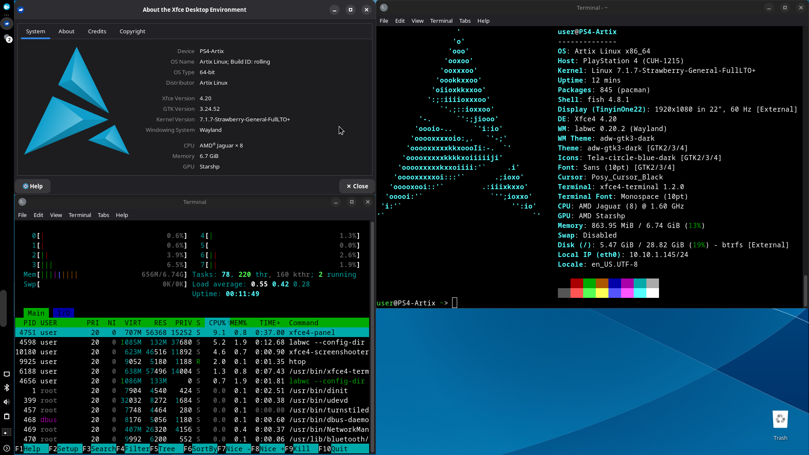

## Artix Linux for PS4

Uses `dinit` as the init system. Includes an XFCE desktop.

New `base` version for those who want to do everything themselves, but don't feel like making a base Artix rootfs.

